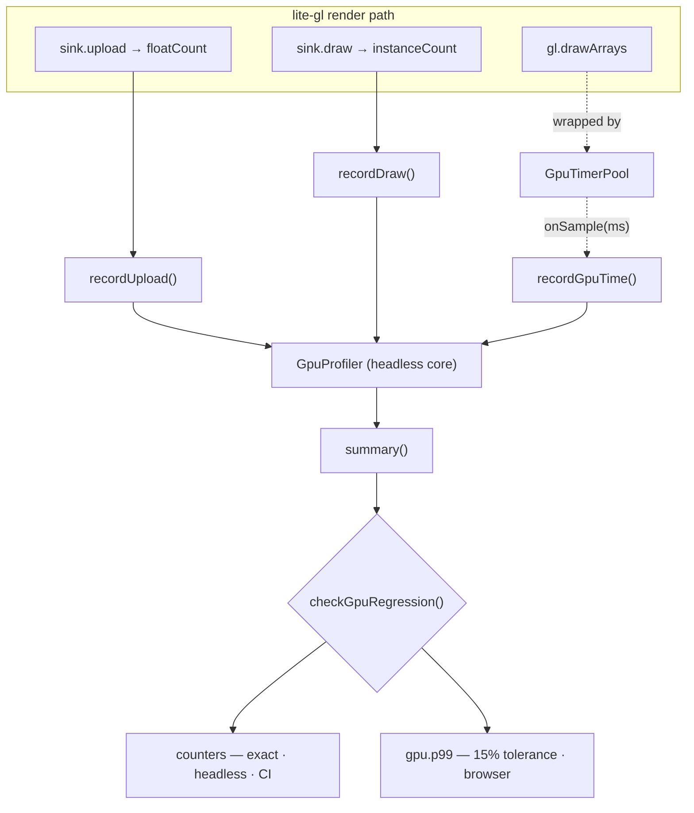

# @zakkster/lite-gpu-profiler

[](https://www.npmjs.com/package/@zakkster/lite-gpu-profiler)

[](https://github.com/sponsors/PeshoVurtoleta)
[](https://bundlephobia.com/result?p=@zakkster/lite-gpu-profiler)
[](https://www.npmjs.com/package/@zakkster/lite-gpu-profiler)
[](https://www.npmjs.com/package/@zakkster/lite-gpu-profiler)
[](https://github.com/PeshoVurtoleta/lite-signal)
[](./LICENSE.txt)
[](#whats-tested)
[](#the-hot-path)
[](#gputimerpool--browser-timer)
[](./index.d.ts)

Zero-GC WebGL2 render-path telemetry. A passive **instrument** — it *measures* the work the
GPU is asked to do — and the counterpart to [`@zakkster/lite-vram`](https://www.npmjs.com/package/@zakkster/lite-vram),
the active **manager** that *governs* texture memory. Together they cover the two questions a
render loop keeps asking: *how much am I uploading and drawing*, and *is that memory safe*.

The whole design turns on one distinction: **command counts are deterministic, GPU time is
not.** So the two live in two places, and gate two different ways.



## Two telemetry kinds, two homes

| | Command counters | GPU time |
| --- | --- | --- |
| **What** | draw calls, instances, floats uploaded | wall-clock nanoseconds on the GPU |
| **Source** | integers the caller already has at flush time | `EXT_disjoint_timer_query_webgl2` |
| **Needs a GL context?** | no — recorded in the GL-agnostic core | yes — browser only |
| **Determinism** | identical on every host and run | noisy; varies frame to frame |
| **Where it runs** | headless, in CI, today | live context, resolved asynchronously |
| **How it gates** | **exactly** — zero tolerance, no noise floor | by fractional **tolerance** |

This mirrors lite-gl's own split: the counters extend its headless, tested core; the timer
extends its browser smoke test. You get a hard, deterministic gate on the numbers that *are*
deterministic, and a tolerant gate on the one number that isn't — instead of pretending GPU
time is reproducible and flaking your CI, or giving up on gating draw calls because they happen
to sit next to a noisy measurement.

## Install

```bash
npm install @zakkster/lite-gpu-profiler
```

Runtime dependencies are two zero-GC siblings from the same ecosystem —
[`@zakkster/lite-ring-buffer`](https://www.npmjs.com/package/@zakkster/lite-ring-buffer)
(the frame rings) and [`@zakkster/lite-stats-math`](https://www.npmjs.com/package/@zakkster/lite-stats-math)
(the percentile math). ESM only.

## Quick start

```js
import { GpuProfiler, checkGpuRegression } from '@zakkster/lite-gpu-profiler';
import { GpuTimerPool } from '@zakkster/lite-gpu-profiler/timer';

const gpu = new GpuProfiler(1024);   // ring capacity in frames

// per frame, driven from lite-gl's reactiveField / sink:
gpu.beginFrame();
gpu.recordUpload(dirtyFloatCount);   // ← sink.upload(data, off, floatCount, ...)
gpu.recordDraw(instanceCount);       // ← sink.draw(count)   (only when a draw happens)
gpu.endFrame();

// browser: wrap the real draw so GPU time flows back in
const pool = new GpuTimerPool(gl, { onSample: (ms) => gpu.recordGpuTime(ms) });
// pool.begin();  gl.drawArrays(...);  pool.end();

const summary = gpu.summary({ label: 'my-scene' });
```

## The metric that matters: `floatsUploaded`

Command counters exist mostly to protect one property: **dirty-range batching.** lite-gl
uploads only the slice of the instance buffer that changed. If that regresses — a one-instance
change quietly re-uploading the whole buffer — nothing *breaks*, the frame just silently costs
100× the bandwidth it should.

`floatsUploaded` makes that falsifiable. A single-instance change must upload exactly one stride,
never the whole buffer, and the default gate pins `counter.floatsUploaded.max` **exactly**.
Likewise `framesDrawn` / `framesSkipped` are derived from the draw-call ring — a frame that
skipped its draw recorded no `drawCalls` — so the "redraw only on change" claim is verifiable
without an extra counter.

## API

### `GpuProfiler` — headless core

The counter and GPU-time aggregator. No GL required; safe to run in node and CI.

```js
new GpuProfiler(capacity?, { counters? })
```

- `capacity` — ring length in frames (how much history the summary spans).
- `counters` — the tracked tags; defaults to `['drawCalls', 'instances', 'floatsUploaded']`.

| Method | Purpose |
| --- | --- |
| `beginFrame()` | clear per-frame accumulators — call every frame |
| `recordDraw(instanceCount?)` | `drawCalls += 1`, `instances += n` — call only when a draw happens |
| `recordUpload(floatCount)` | `floatsUploaded += n` — the dirty-range signal |
| `add(tag, n?)` | bump an arbitrary tracked counter |
| `recordGpuTime(ms)` | ingest a resolved GPU-time sample from the pool |
| `endFrame()` | flush the frame's totals into the rings |
| `summary(meta?)` | snapshot (shape below); `meta` merges in |
| `reset()` / `destroy()` | clear history / release |

Getters: `counterCount`, `capacity`, `counterTags`.

### `GpuTimerPool` — browser timer

Subpath `@zakkster/lite-gpu-profiler/timer`. Wraps the real draw and feeds resolved GPU time
back to `recordGpuTime`.

```js
new GpuTimerPool(gl, { poolSize?, onSample? })
```

- `poolSize` — how many queries may be in flight (bounds resolution lag; default `4`, min `2`).
- `onSample(ms)` — called with each resolved sample.

| Method | Purpose |
| --- | --- |
| `begin()` | resolve the oldest finished query, then open a new one — call *before* the draw |
| `end()` | end the open query — call *after* the draw |
| `onSample(cb)` | register the sample callback |
| `dispose()` | delete every query (no leaked handles) |

Getter: `supported` — `false` when the extension is absent, in which case `begin`/`end` are
no-ops and the counters still work.

WebGL2 timer queries are asynchronous — a result lands one to three frames after `end()`. The
pool keeps a fixed ring of pre-allocated query objects, starts **one** `TIME_ELAPSED` region per
frame (only one may be active at a time — no nesting), reads each result late, and **drops** any
frame whose `GPU_DISJOINT` flag is set, because a context switch or thermal throttle makes that
timing meaningless. It allocates nothing after construction.

## The summary

```js
gpu.summary({ label: 'my-scene' })
```

```
{
  schema: 'lite-gpu-profiler/summary@1',
  frameCount, capacity,
  counters: {                         // one entry per tracked tag
    drawCalls:      { sum, min, max, avg, last },
    instances:      { sum, min, max, avg, last },
    floatsUploaded: { sum, min, max, avg, last }
  },
  framesDrawn, framesSkipped,         // derived from the drawCalls ring
  gpu: { avg, min, max, p01, p99, samples }   // empty-safe when no GPU time was recorded
}
```

Counter rings are `Float32`-backed, so per-frame counter **values** are exact up to
2²⁴ (16,777,216) — e.g. 2M instances × 8 floats. Beyond that they quantize *deterministically*:
identical runs still gate equal; only the printed value rounds. An `exact` gate rule
whose operands reach this ceiling is surfaced in the report's `warnings` array (see the
regression gate below), because a sub-quantum regression there is undetectable.

## Regression gate

Compare a candidate summary against a stored baseline. Same posture as `lite-profiler` — the
counters slot into the same matrix.

```js
import { checkGpuRegression, assertNoGpuRegression, GPU_DEFAULT_RULES } from '@zakkster/lite-gpu-profiler';

const report = checkGpuRegression(baseline, candidate /*, rules */);
// report -> { ok, verdict, regressions, inconclusive, warnings }
//   verdict: 'pass' | 'fail' | 'inconclusive'   (ok === verdict === 'pass')
//   regressions / inconclusive / warnings: [{ metric, baseline, candidate, rule, reason }]

assertNoGpuRegression(baseline, candidate);   // throws; err.report carries the result
```

The gate is **fail-closed**. A rule it cannot evaluate against a real measurement -- a
`gpu.*` stat whose candidate has `gpu.samples === 0` (headless CI with no timer
extension), a poisoned non-finite/null stat, or a counter tag neither summary tracks --
routes to `inconclusive`, never a green pass. Two summaries whose `schema` tokens differ
are incomparable and short-circuit to `inconclusive` before any rule runs (two
un-stamped summaries are treated as comparable). A misspelled rule path throws
`GpuRuleError` before anything is evaluated. `assertNoGpuRegression` throws
`GpuRegressionError` on a `fail` and `GpuInconclusiveError` on an `inconclusive`, so CI
can tell "did not measure" from "regressed" from "clean". Those error classes are not
exported from the package entry point, so branch CI on `err.name === 'GpuRegressionError'`
/ `'GpuInconclusiveError'` and on `err.report.verdict`, not on `instanceof`.

The report also carries a `warnings` array (always present, never affecting
`verdict`/`ok`): an `exact` rule whose operands reach 2^24 is flagged, because the
`Float32` counter ring quantizes there and a regression smaller than the quantum is
invisible to an exact gate -- see the counter-precision note above.

Rules are keyed by a metric path — `counter.<tag>.<sum|max|min|avg|last>` or `gpu.<field>`:

| Rule | Regresses when | For |
| --- | --- | --- |
| `{ exact: true }` | `candidate !== baseline` | deterministic counters |
| `{ max: N }` | `candidate > N` | an absolute ceiling |
| `{ tolerance: 0.15 }` | `(candidate − baseline) / baseline > 0.15` | noisy GPU time |

The defaults gate the two claims that matter and nothing you'd have to babysit:

```js
GPU_DEFAULT_RULES = {
  'counter.floatsUploaded.max': { exact: true },   // dirty-range batching
  'counter.drawCalls.max':      { exact: true },   // draw-call count
  'gpu.p99':                    { tolerance: 0.15 } // frame-time tail within 15%
}
```

## Wiring into @zakkster/lite-gl

lite-gl draws the whole instanced field in one call per frame, so the sink's `draw()` *is* the
frame boundary. Two seams:

- **Counters — in the GL-agnostic core (headless, matrix-gated).** Where `GLBackend`'s sink is
  called from `reactiveField.flush`, forward the arguments and bracket the frame:

  ```
  upload(data, floatOffset, floatCount, instanceOffset, stride) → profiler.recordUpload(floatCount)
  draw(count)                                                   → profiler.recordDraw(count)
  // profiler.beginFrame() … profiler.endFrame() around the flush
  ```

- **GPU time — in the WebGL2 sink (browser).** In `createPointSink`, build
  `new GpuTimerPool(gl, { onSample: (ms) => profiler.recordGpuTime(ms) })`, call `pool.begin()`
  before `gl.drawArrays` and `pool.end()` after. Recreate the pool in `onContextRestored` —
  queries die with the context.

## What's tested

| Layer | How |
| --- | --- |
| Core counters + gate | `node:test`, headless, deterministic |
| Timer-pool state machine | `node:test` against a mock GL — cycling, resolution lag, FIFO order, disjoint-drop, pool reuse (zero per-frame alloc), no leaked handles |
| Actual GPU nanoseconds | not verified here -- driver-reported via `EXT_disjoint_timer_query_webgl2`; no WebGL2 under node. The ns->ms conversion and FIFO ordering are covered by the mock-GL suite |

```bash
npm test        # node --test (headless)
npm run test:gc # under --expose-gc
```

## The hot path

`recordDraw` / `recordUpload` / `recordGpuTime` allocate nothing — each writes a `Float64`
accumulator or pushes a single float into a ring. There is no per-frame garbage, which is the
point: an instrument that allocated on the render path would perturb the very thing it measures.

## Scope (v1)

v1 is **frame-level** — one GPU-time region per frame, matching lite-gl's single instanced draw.
Per-pass timing (sequential queries) and pass-scoped counters are deferred. An optional dev-only
GL-context monkey-patcher for automatic command counting during discovery is a separate
supplemental tool; production gates run on the explicit API.

## License

MIT © Zahary Shinikchiev
